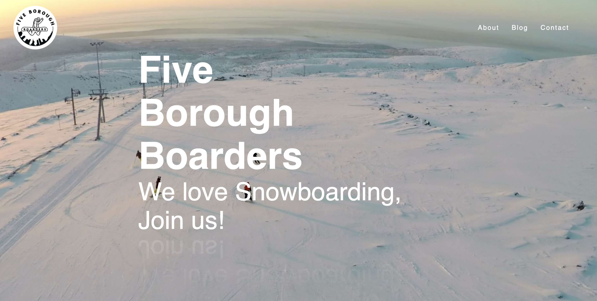

# Five Borough Boarders Website 🏂

## Project Introduction

**What is this project?**

Website for Five Borough Boarders 🏂!

---

## 🚀 Tech Stack

**Frontend:**  

**Backend:**  

**Database:**  
_Coming soon_  

**Deployment & Infrastructure:**  

**Logging & Monitoring:**  

**Development Tools:**  

**License:**  

Permission is hereby granted, free of charge, to any person obtaining a copy
of this software and associated documentation files (the "Software"), to deal
in the Software without restriction, including without limitation the rights
to use, copy, modify, merge, publish, distribute, sublicense, and/or sell
copies of the Software, subject to the following conditions:

The above copyright notice and this permission notice shall be included in all
copies or substantial portions of the Software.

THE SOFTWARE IS PROVIDED "AS IS", WITHOUT WARRANTY OF ANY KIND, EXPRESS OR
IMPLIED.

NOTE: All images and media in this repository belong to the client and
are **not included** in the MIT license. They may **not** be reused without permission.

## Changelog

### v1.0.1

- First draft/ proof of concept.
- Added preview images to be sent from the server.

---

For more details, see the source code and comments in the respective modules.
